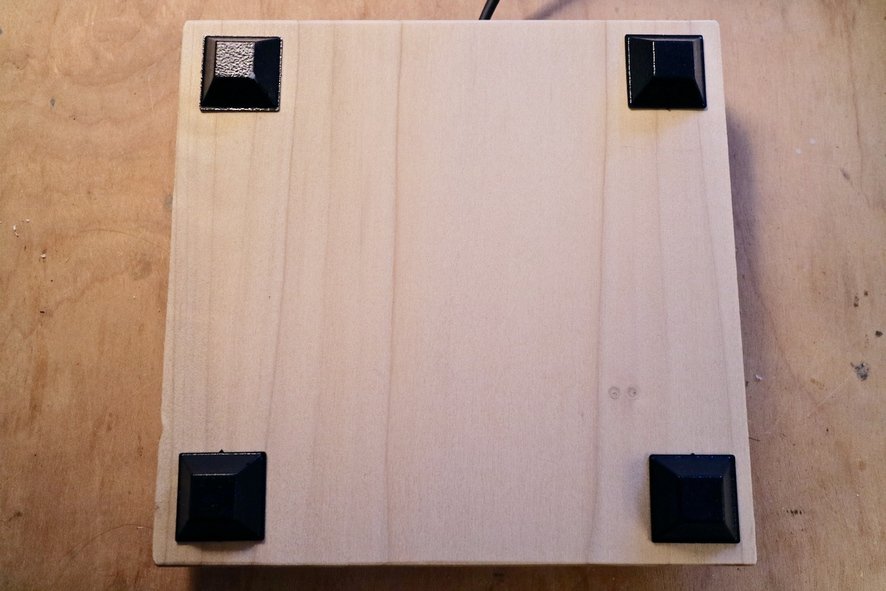

## Metropolacy Interface Fabrication Instructions

### **Materials Needed**
#### Electronics
- 1 X standard piezoelectric disc
- 1 X XLRM connector
- Length of shielded 3 conductor audio cable, approximately 14" (e.g. the type used for mic cables)

#### Hardware
- Piece of 1" X 6" hardwood, approximately 5 1/2" square
- 4 X 3/4" #6 wood screws
- 1 X blank 2-gang "indestructible" nylon electrical outlet wall plate (e.g. [these](https://www.homedepot.com/p/Leviton-2-Gang-Midway-Blank-Nylon-Wall-Plate-White-R52-0PJ23-00W/202059889))
- 4 X rubber feet

#### Miscellaneous
- Medium grit sandpaper
- Gaffer or electrical tape

### **Tools Needed**
- Saw (band, miter, hand, etc.)
- Drill (drill press is best)
- 7/64" drill bit
- Screwdriver
- Soldering iron and solder

### **Procedure**

#### Soldering and electronics
1. Strip approximately 3/4" of the outer jacket from both ends of the cable segment, then strip a small amount from the end of each wire.
2. On one end of the cable segment, solder the red wire to the inner part of the piezo disc and both the black and stranded wires to the outer metal part of the disc.
    
    
3. Solder an XLR connector to the other end of the cable. The stranded wire goes to pin 1, red wire to pin 2, black wire to pin 3.

#### Wood work
*All pilot holes should be drilled 1/2" deep using 7/64" bit.*  
1. Drill 4 pilot holes in the wood square for the electrical plate. Plate should be centered.

    
2. Send edges and corners as desired.

#### Assembly and finishing touches
1. Sand the surface of the 2-gang plastic plate until it is evenly textured.
2. Tape the piezo disc to the bottom of the 2-gang plate. Angle the disc so that the wire passes out the middle of the plate. Try to only adhere tape to the metal part of the disc to avoid damaging the inner part. Add an extra piece of tape to secure the cable.
    
    
3. Cut a piece of foam to fit under the 2-gang plastic plate, approximately 4 3/4" square. Place the foam under the plate. Insert 4 of the wood screws through the plate holes and push them through the foam.
    
    
4. Afix 4 rubber feet to the bottom corners of the wood.

    
5. Screw the plastic plate onto the board with the piezo and foam underneath. All of these screws should be just hand tightened - DO NOT over tighten. The interface is now fully assembled.

    

