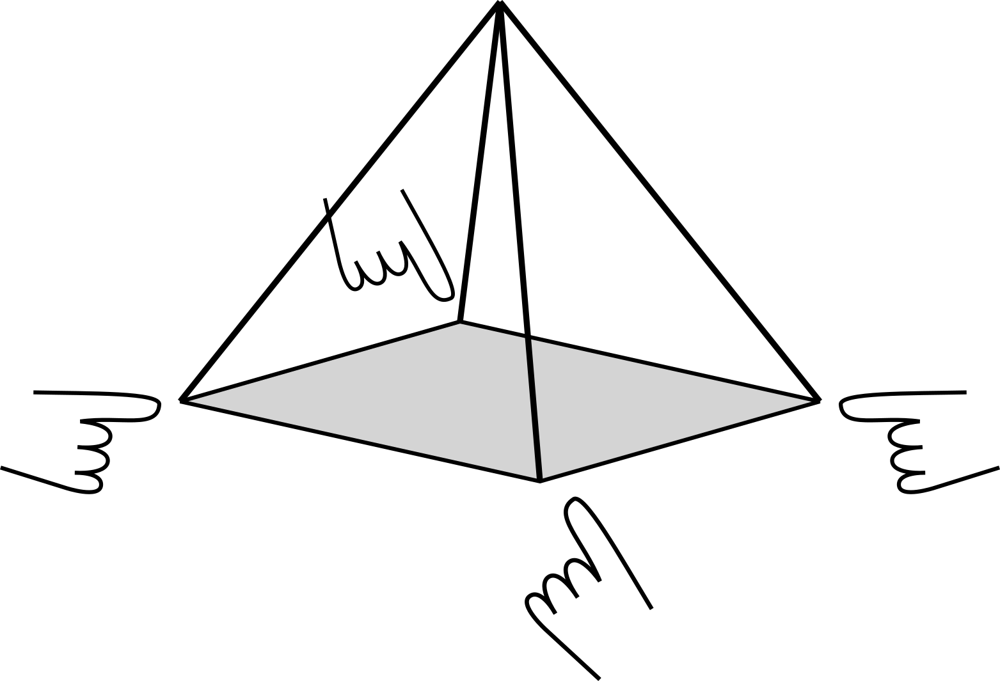

# Resuscitation

*Resuscitation* is a composition for laptop quartet situated within laptop ensemble and percussion ensemble performance practice. All four performers use independent laptop-based setups, including localized amplification. Performers collectively play a physics-based virtual instrument designed to resemble four strings coupled to a resonant plate. Excitation of the model is generated by striking and plucking piezoelectric elements to excite the plate and strings, respectively.

The instrument in *Resuscitation* is realized using realtime audio streaming between laptops over a local wired network.

Fabrication instructions for the interfaces can be found [here](fabrication.md).

Software and hardware setup instructions can be found [here](setup.md).

Performance instructions can be found [here](performance.md).

Video recording of a live *Resuscitation* performance can be found [here](https://youtu.be/dxOa_NOT9Rw).

