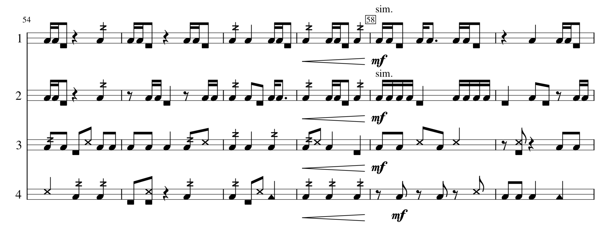

## Resuscitation Performance Instructions

Notation generally follows standard percussion notation practice. Text instructions are supplied as needed.

Notes above the staff are string plucks, performed by plucking the film piezo tine.

Notes within the staff are gestures played on the plate. Notes in the top space are performed using an implement as instructed. They are also given X and triangle shaped note heads to help differentiate them from other notes. Notes in the bottom space are performed using fingers on the plate. Buzz roll notation (a Z on the stem) should be performed as a single quick "ruff" or "drag" with all four fingers ([see demonstration](https://youtu.be/xBmuuR-gvvQ?t=26)).

Notes below the staff are damping gestures performed by pressing the FSR sensor. Rhythms should be respected as much as possible (i.e. onset and release should closely adhere to notated durations).

Rehearsal markings double as laptop preset indicators. The corresponding number key on the keyboard should be pressed on the downbeat of the measure where the rehearsal marking is placed.

